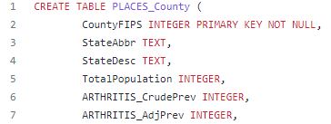

# Final_Project

Topic: US Health

## Reason topic was selected:
Dataset is large and encompases possible variables that may be related to one another.  It also includes mapping components.  Health is a topic that affects everyone.  We wanted to better understand how health metrics might differ by location.

## Data source
We are using data from the 2021 Places Census data.  This data provides statistical estimates of measures related to health outcomes, prevention, and health risk behaviors for counties in the United State.  These are determined by combining various surveys for the same populations. 
The data is sourced through the The United States Census bureau by counties

https://chronicdata.cdc.gov/500-Cities-Places/PLACES-Census-Tract-Data-GIS-Friendly-Format-2021-/yjkw-uj5s

## Questions we hope to answer with the data
Main Question
- Can we predict a propensity of cancer based on rural or urban classification?

Possible alternative/supplemental questions
- Are there behaviors that can be used to predict a population's medical outcomes such as cancer.
- Is there a difference in medical outcomes for populations based on if they sleep less than 7 hrs a day.
- Are there locations that have differences in their medical outcomes to help identify areas where there may be interventions.
- Does living in metropolitan area lead to higher health risks?
- A specific health factor e.g Is there a correlation between hours of sleep per a night and obesity?

## Slides

https://docs.google.com/presentation/d/15OZkmBjv44i-xoq12jIVcF1bP-0Hgk-oNm7jcBNWap8/edit?usp=sharing

## Communication protocols
The team is using slack to communicate between classes.  We also have a file to help us determine best times to meet outside of class if needed.  We are going to use slack for notifications on updates to the main branch.

## Tools to be used:
- Python
- Jupyter Notebook
- Tableau for mapping
- Postgres for our database

## Steps for pre-processing
- Identify which rows we want to keep
- Deleting null rows
- Create a table that we can use to label the rows as urban, or rural.

## Machine Learning Model

### Data preprocessing

The first dataset that was preproccessed was the **PLACES_County** CSV file. The data was read into a Jupyter Notebook as a DataFrame and filtered to drop confidence interval columns. 
``dropna()`` was applied to the DataFrame and a loop was used to create a new column that labels rows based on total population of each county. The DataFrame was then saved as a CSV and imported into an AWS server in a google colab notebook.

The second dataset that was preprocessed was the **census_county_pop** CSV file. the data was read into a Jupyter Notebook as a DataFrame and filtered to drop empty columns. A loop then used to create a new column that contains labels based on population density for each row. This DataFrame was then saved as a CSV and imported into an AWS server in a google colab notebook.

### feature engineering

### training and testing

### model choices

PCA and K-means clustinging will be used to identify unique clusting in the data. Input will be all health related variables and the **RuralUrban** column encoded. The features will be scaled and PCA will be applied to reduce dimensionallity to three components. This will allow the data to be plotted using 3D graphs. Drilling down, each category of data will have clustering applied. This includes preventative service, risk factors, and health outcomes.

Linear and multiple linear regression will be used to predict cancer rate using the categorized health data as features.  

## Databases

- We are using PostgreSQL hosted by AWS. We are creating two tables. One table contains our county variable (Health related data) and the other has a population density data.In addition, we are using PySpark to transform, load and extract before hosting on a remote server.
- The machine learning model will be connected to the database (PostgreSQL).

## Dashboard 

* Description of tools
    * Tableau - we want to use a Tableau to create various graphs and add them to our website
    * Dash - We want to use Dash to create our website and display our findings and pgraphs 
* Interactive elelments
    * Interactive map where you can look at all the counties in the country we have data from 
    * Pull down menu of the counties that will show the health measures of the area

