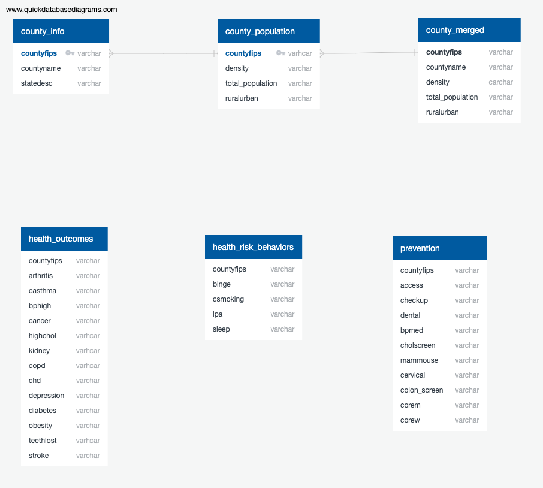

# Final_Project

Topic: US Health

## Reason Topic Was Selected:
Dataset is large and encompases possible variables that may be related to one another.  It also includes mapping components.  Health is a topic that affects everyone.  We wanted to better understand how health metrics might differ by location.

## Data Source
We are using data from the [2021 Places Census data](https://chronicdata.cdc.gov/500-Cities-Places/PLACES-County-Data-GIS-Friendly-Format-2021-releas/kmvs-jkvx).  This data provides statistical estimates of measures related to health outcomes, prevention, and health risk behaviors for counties in the United State.  These are determined by combining various surveys for the same populations. 
The data is sourced through the The United States Census bureau by counties

## Questions We Hope To Answer With The Data
Main Question
- Can we predict a propensity of cancer based on other categories of health metrics from the same county?

Possible alternative/supplemental questions
- Are there behaviors that can be used to predict a population's medical outcomes such as cancer.
- Is there a difference in medical outcomes for populations based on if they sleep less than 7 hrs a day.
- Are there locations that have differences in their medical outcomes to help identify areas where there may be interventions.
- Does living in metropolitan area lead to higher health risks?
- A specific health factor e.g Is there a correlation between hours of sleep per a night and obesity?

## Slides

https://docs.google.com/presentation/d/15OZkmBjv44i-xoq12jIVcF1bP-0Hgk-oNm7jcBNWap8/edit?usp=sharing

## Communication Protocols
The team is using slack to communicate between classes.  We also have a file to help us determine best times to meet outside of class if needed.  We are going to use slack for notifications on updates to the main branch.

## Tools To Be Used:
- Python
- Jupyter Notebook
- Tableau for mapping
- Postgres for our database

## Data Exploration And Analysis
We reviewed distributions by using box plots to better understand the various measures in our dataset.  We compared the crude with the age adjusted columns and determined to keep the age adjusted columns based on our approach of comparing measures accross counties.  We also completed some quick scatterplots and saw that some of the relationships between measures appeared to be linear.

## Steps For Pre-Processing  
- Dropped redundant columns
- Deleted null rows
- Added a column to designate whether a county would be defined as an urban or rural county
*should this be deleted?

## Machine Learning Model

### Data preprocessing

The first dataset that was preproccessed was the **PLACES_County** CSV file. The data was read into a Jupyter Notebook as a DataFrame and filtered to drop confidence interval columns. 
``dropna()`` was applied to the DataFrame and a loop was used to create a new column that labels rows based on total population of each county. The DataFrame was then saved as a CSV and imported into an AWS server in a google colab notebook.

The second dataset that was preprocessed was the **census_county_pop** CSV file. the data was read into a Jupyter Notebook as a DataFrame and filtered to drop empty columns. A loop then used to create a new column that contains labels based on population density for each row. This DataFrame was then saved as a CSV and imported into an AWS server in a google colab notebook.

### Feature Engineering

### Training and Testing

### Model Choices

Linear and multiple linear regression will be used to predict cancer rate using the categorized health data as features. Each catergory of health data will be used in a multiple linear regression to create their own predictions. R-squared and P-values will be examined to determine effectiveness and confidence of the data's relationships.

## Databases

- We are using PostgreSQL hosted by AWS. We are creating two tables. One table contains our county variable (Health related data) and the other has a population density data.In addition, we are using PySpark to transform, load and extract before hosting on a remote server.
- The machine learning model will be connected to the database (PostgreSQL).

## Dashboard 

* Description of tools
    * Tableau - we will use Tableau to create various graphs, including an interactive map, and add them to our website
    * Dash - we will use Dash to create our website and display our findings of the health measures we analyzed in different counties 
* Interactive elelments
    * Interactive map where the user can look at all the counties we have data from that will show information about the health measures we analyzed
    * Pull down menu of the counties that will display the health measures of the area

